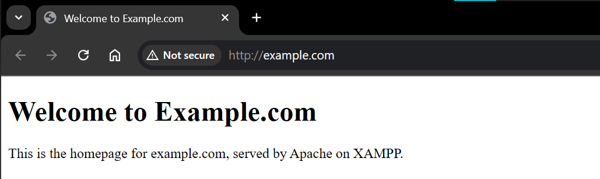
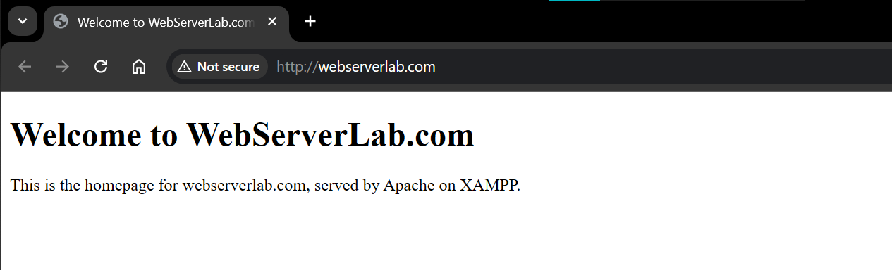
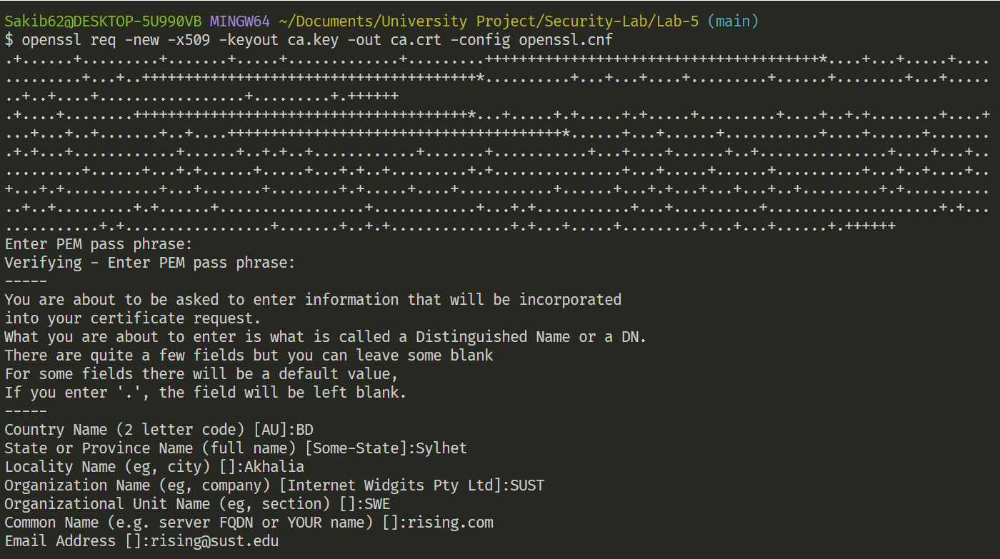
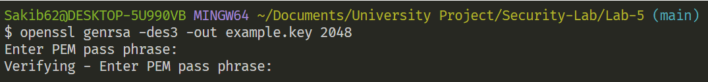
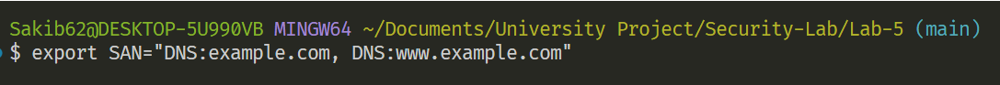
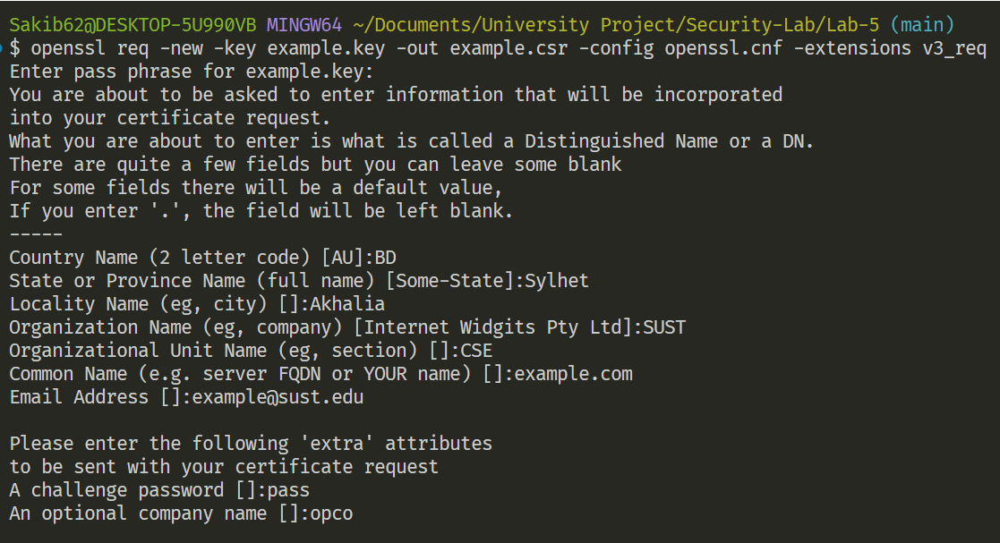
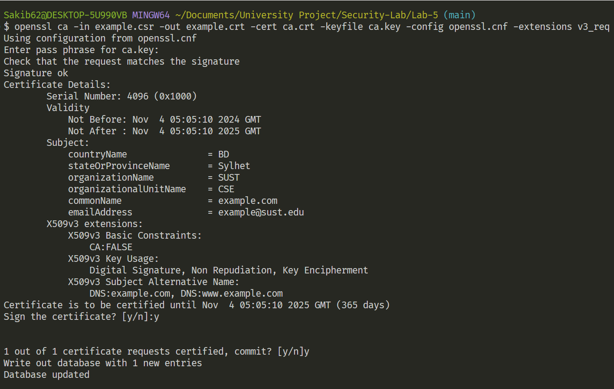
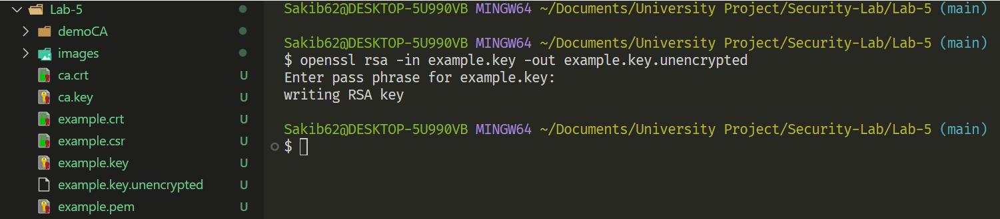
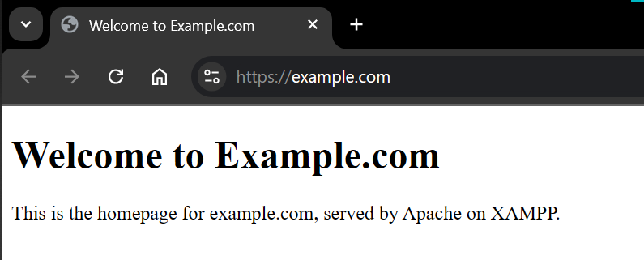

# Lab 5 - Securing Apache Web Server

- **Task 0** - [Configuring the apache server for different virtual hosts](#task-0---configuring-the-apache-server-for-different-virtual-hosts)

- **Task 1** - [Create a Certificate Authority (CA)](#task-1---create-a-certificate-authority-ca)

- **Task 2** - [Create a certificate for example.com](#task-2---create-a-certificate-for-examplecom)

- **Task 3** - [Launching web server with the generated certificate](#task-3---launching-web-server-with-the-generated-certificate)

- **Task 4** - [Configure Apache to Use HTTPS](#task-4---configure-apache-to-use-https)

<hr><hr>

### Task 0 - Configuring the apache server for different virtual hosts

1. **Verify Apache Setup :**

    - In Windows, ensure Apache is running by starting it in the XAMPP Control Panel.
    - Access http://localhost in a browser to confirm Apache is serving pages.

2. **Set Up Virtual Hosts :**

    - Go to the directory where xampp is installed (usually C:/xampp)  and open `apache\conf\extra\httpd-vhosts.conf`.
    - Add configurations for two virtual hosts (e.g., example.com and webserverlab.com):
    -   ```apache
        <VirtualHost *:80>
            ServerAdmin admin@example.com
            DocumentRoot "C:/xampp/htdocs/example"
            ServerName example.com
            ErrorLog "logs/example.com-error.log"
            CustomLog "logs/example.com-access.log" common
        </VirtualHost>

        <VirtualHost *:80>
            ServerAdmin admin@webserverlab.com
            DocumentRoot "C:/xampp/htdocs/webserverlab"
            ServerName webserverlab.com
            ErrorLog "logs/webserverlab-error.log"
            CustomLog "logs/webserverlab-access.log" common
        </VirtualHost>
        ```
    - Save and restart Apache in XAMPP.

3. **Check DocumentRoot Paths :**

    - Make sure the folders specified in DocumentRoot for each virtual host actually exist and contain an index.html or index.php file.<br>For example, if you have ```DocumentRoot "C:/xampp/htdocs/example"```
    <br>Ensure that:
    The folder `C:/xampp/htdocs/example` exists 
    and there’s a file like `index.html` or index.php in that folder.

4. **Update Hosts File :**

    - Open the hosts file at        `C:\Windows\System32\drivers\etc\hosts`.
    - Add these entries
        ```
        127.0.0.1 example.com
        127.0.0.1 webserverlab.com
        ```
    - Save the file (administrator access required).

5. **Test Virtual Hosts :**

    - In a browser, navigate to http://example.com and http://webserverlab.com to ensure they display correctly.
    - <br><br>
    


<br><hr>

### Task 1 - Create a Certificate Authority (CA)

1. **Configure openssl.cnf :**

    - Copying the openssl.cnf file from `/usr/lib/ssl/openssl.cnf` to current directory.
    - Modifying openssl.cnf to suit the requirements, focusing on adjustments within the [CA_default] section to define directories and settings appropriately.
    - `dir = ./demoCA`, so create `demoCA` folder in the working directory and inside the demoCA folder, create another empty folder named `newcerts` and two files - index.txt (empty) and serial. For the serial file, put a single number (e.g. 1000) in the file

2. **Generate a Root CA Certificate :**

    - Run the following command to generate the self-signed certificate for the CA:<br>
        ```bash
        openssl req -new -x509 -keyout ca.key -out ca.crt -config openssl.cnf
        ```
    - Follow the prompts to fill in the certificate details.
        <br><br>
    - The output of the command are stored in two files: ca.key and ca.crt. The file ca.key contains the CA’s private key, while ca.crt contains the public-key certificate.

<br><hr>

### Task 2 - Create a certificate for example.com

1. **Generating public/private key pair :**

    - ```openssl genrsa -des3 -out example.key 2048``` higher key length recommended.
    <br><br>
    - Recent versions of Chrome (and other browsers) require certificates to have a SAN (Subject Alternative Names), even if a Common Name (CN) is present.
    - Adding SANs to the openssl.cnf file can be done dynamically for each certificate, without hardcoding specific sites in the configuration.
    - Open `openssl.cnf`, add `subjectAltName = $ENV::SAN` in [ v3_req ] section.

2. **Generate a Certificate Signing Request (CSR) for example.com :**
    
    - When issuing a certificate for a specific domain, set the SAN environment variable to include the appropriate domain name(s). For example, if you’re creating a certificate for example.com: `export SAN="DNS:example.com, DNS:www.example.com"`
    <br><br>
    - ```openssl req -new -key example.key -out example.csr -config openssl.cnf -extensions v3_req```
    <br><br>
    - Use example.com as the common name of the certificate request.
    - Except organizational unit and email, other fields value need to match with the CA's value (as CA policy = policy match).

3. **Generate Certificate :**

    - ```openssl ca -in example.csr -out example.crt -cert ca.crt -keyfile ca.key -config openssl.cnf```
    <br><br>

<br><hr>

### Task 3 - Launching web server with the generated certificate

1. **Combine the secret key and certificate into one file :**

    - `cp example.key example.pem`
    - `cat example.crt >> example.pem`
    <br><br>

2. **Launch the web server using example.pem :**

    - ` openssl s_server -cert example.pem -www`
    <br><br>
    - The server can be accessed using the following URL: https://example.com:4433/. Most likely, the browser will show an error message.
    - Error in command line
    <br>
     
3. **Error message from browser :**

    - Because, the certificate of example.com is signed by our own CA (i.e., using ca.crt), and this CA is not recognized by browser.
    <br><br>

4. **Manually adding our CA’s certificate to the browser :**

    - In Chrome browser, follow this sequence: Settings -> Privacy and security -> Security -> Manage Certificates -> Manage imported certificates from Windows
    - Then follow:
    <br><br>
    
    
    
    
    

5. **Certificate details in webpage :**

    - Point the browser to https://example.com:4433
    <br><br>

6. **Certificate in Chrome :**

    - Example.com's certificate details
    <br><br> 

<br><hr>

### Task 4 - Configure Apache to Use HTTPS

1. **Modify the Virtual Hosts Configuration for HTTPS :**

    - Open `xampp\apache\conf\extra\httpd-vhosts.conf`.
    - Add an HTTPS block for example.com and webserverlab.com
        ```apache
        <IfModule mod_ssl.c>
            <VirtualHost *:443>
                ServerAdmin admin@example.com
                DocumentRoot "C:/xampp/htdocs/example"
                ServerName example.com
                
                SSLEngine on
                SSLCertificateFile "C:/path/to/your/example.crt"
                SSLCertificateKeyFile "C:/path/to/your/example.key"
            </VirtualHost>
            
            <VirtualHost *:443>
                ServerAdmin admin@webserverlab.com
                DocumentRoot "C:/xampp/htdocs/webserverlab"
                ServerName webserverlab.com
                
                SSLEngine on
                SSLCertificateFile "C:/path/to/your/webserverlab.crt"
                SSLCertificateKeyFile "C:/path/to/your/webserverlab.key"
            </VirtualHost>
        </IfModule>
        ```
    - Replace C:/path/to/your/ with the actual paths to the certificates you generated.
    - **Apache on Windows does not support passphrase-protected private keys.** So, we need to generate an unencrypted version of the private key.
    - Run the command in the working directory - `openssl rsa -in example.key -out example.key.unencrypted`
    - This will prompt you for the passphrase for example.key, which you need to enter. OpenSSL will then create a new file, example.key.unencrypted, without the passphrase.
    <br><br><br>
    - Update your Apache configuration in `httpd-vhosts.conf` to reference example.key.unencrypted or rename example.key.unencrypted to example.key<br>
    `SSLCertificateKeyFile "C:/path/to/your/example.key.unencrypted"`

2. **Enable SSL in Apache :**

    - In the XAMPP Control Panel, go to the Apache configuration (Config > Apache (httpd-ssl.conf)).
    - Uncomment or add `LoadModule ssl_module modules/mod_ssl.so` to enable SSL.
    - Restart Apache.

3. **Test HTTPS :**

    - Open a browser and navigate to https://example.com and https://webserverlab.com.
    <br><br>
    - Import the CA certificate (ca.crt) into your browser's trusted certificates if it flags the connection as insecure.

After completing these steps, we should have a secure Apache server using self-signed certificates for HTTPS.
